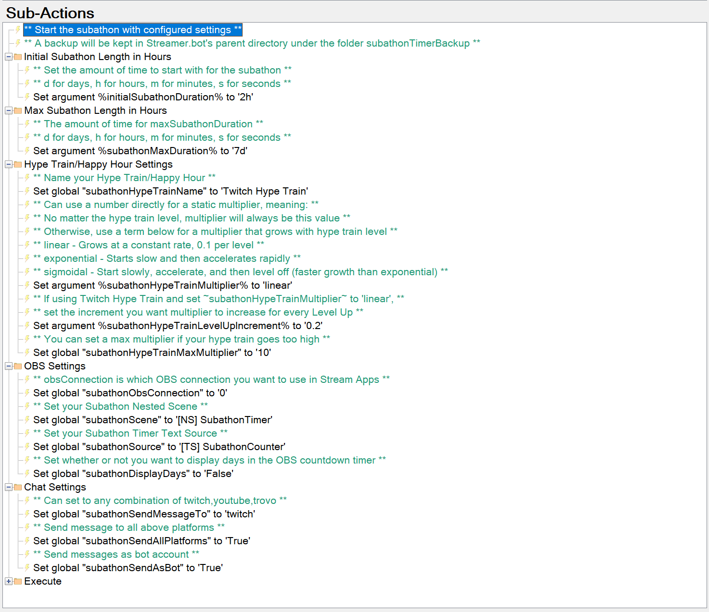
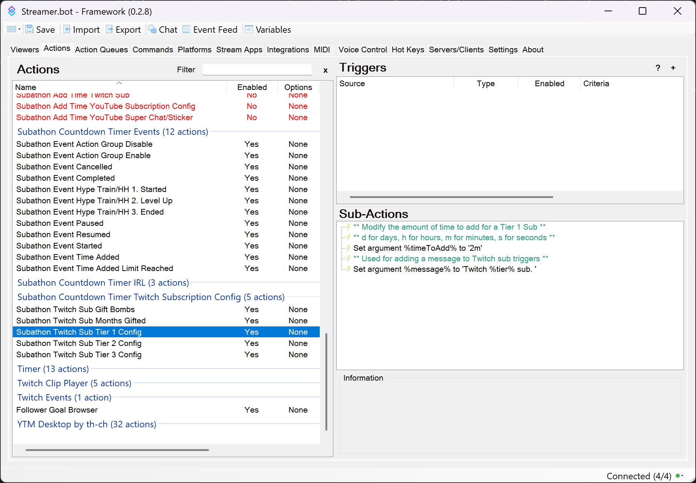

# Streamer.bot Subathon Countdown Timer

## Description

By using this extension, you can run a Stream Marathon timer (aka Subathon) on your stream easily. The paid version also has support for other integrations that involve tips.

When you run a Subathon, you can run a timer that updates a text source inside of a nested scene within OBS. Time can be automatically added via the various integration triggers.

### Capabilities

These are the various ways you can add time:

- Manually via chat command (included in free version)
- Twitch subscriptions and re-subscriptions for each tier (Included in free version)
- Twitch gifted subscriptions for each tier and if multiple months are gifted (included in free version)
- Twitch gift bombs for each tier and the quantity of subscriptions gifted (included in free verison)
- Twitch cheers
- Twitch follows
- Twitch raids
- Twitch charity donation
- Twitch Hype Train or manually triggered Happy Hour to multiply time added
- DonorDrive donation
- Fourthwall donation
- Ko-Fi donation
- StreamElements tip
- StreamLabs donation
- TipeeeStream tip
- YouTube new subscriber (similar to Twitch follow)
- YouTube Super Chat / Super Sticker

### Planned features

- YouTube new sponsor (similar to first time Twitch Subscription)
- YouTube membership milestone (similar to Twitch Re-subscription)
- YouTube membership gift (similar to Twitch Gift Subscription)
- Trovo spell cast
- Trovo subscription / re-subscription
- Trovo gift subscription
- Trovo mass gift subscription

## Changelog

```diff
2.2.0
+ Exported from Streamer.bot v0.2.8
+ Updated backup files to use TimeStrings instead of seconds
+ Updated paused time to use unicode symbol for pausing '⏸'
+ Added a way to customize the name of your Twitch Hype Train/Happy Hour
+ Added tracking how much time is added during a Twitch Hype Train/Happy Hour and display after Twitch Hype Train/Happy Hour ends
+ Added more logging to assist in troubleshooting
+ Added global variable: ~subathonHypeTrainLevelUpIncrement~ used to configure how much to increment multiplier when Twitch Hype Train Level Up triggers
+ Added global variable: ~subathonTimeAdded~
+ Added global variable: ~subathonTimeElapsed~
+ Added global variable: ~subathonTimeRemaining~
+ Added global variable: ~subathonLastHypeTrainRegularTimeAdded~
+ Added global variable: ~subathonLastHypeTrainExtraTimeAdded~
+ Added global variable: ~subathonLastHypeTrainTotalTimeAdded~
+ Added global variable: ~subathonLimitReachedDateTime~
+ Added global variable: ~subathonLimitReached12~
+ Added global variable: ~subathonLimitReached24~
+ Added custom event triggers
+ Moved many message configurations to Subathon Event actions
- Fixed bug with adding time when Streamer.bot has just opened, but timer has not been resumed yet, causing the subathon to complete when resuming the timer

2.1.1
- Fixed bug with GetTimerStringLong introduced in 2.1.0

2.1.0
+ Exported from Streamer.bot v0.2.6
+ Added Hype Train/Happy Hour actions to multiply time added
+ Added Twitch Sub verbage to include months gifted and quantity of gift bombs
+ Added Fourth Wall Donation action
+ Added option via global variable to display days (find in Subathon 1. Configuration and Start, global variable called ~subathonDisplayDays~)
+ Added ability to send chat messages any combination of Twitch, YouTube, and Trovo
+ Updated timeStringShort to display days with a #. (Example: 5.04:03:02 to represent 5 days, 4 hours, 3 minutes, and 2 seconds)
+ Moved Twitch Sub action config to their own group 'Subathon Countdown Timer Twitch Subscription Config'
```

## Installation

1. Download the .sb import code
2. In Streamer.bot, open the `Import Dialog`
3. Open the folder where you saved the import code then drag-and-drop the .sb file into the `Import String` box
4. Click `Import`
5. Enable the commands `Start Subathon Timer` and `Resume Subathon Timer`

## Configuration

### Streamer.bot Configuration

---

**Note**: Any of the Set Argument subactions that require a duration can use the following syntax:

`d for days, h for hours, m for minutes, s for seconds`

Examples: `5d4h3m`, `1h30m`, `5m`, `1h`

---

#### Subathon Configuration and Start

Most of the configuration for the timer will be done in the action `Subathon 1. Configuration and Start`. Running this action will start the Subathon timer with the configured settings.

| Name | Description | Example |
| --- | --- | --- |
| **Countdown Timer Settings** |   |   |
| `initialSubathonDuration` | Set to how long you want to start your stream | `3h` |
| `subathonMaxDuration` | Set to how long you want the limit of your subathon to be | `2d` |
| **Twitch Hype Train / Happy Hour Settings** | Multiply time added while a Twitch Hype Train or a designated Happy Hour event is live |   |
| `subathonHypeTrainName` | Customize the name of your Hype Train/Happy Hour | `Twitch Hype Train` |
| `subathonHypeTrainMultiplier` | Options:<br>`#` - Use a number for a constant multiplier<br>`linear` - Grows at constant rate, 0.1 per level<br>`exponential` - Starts slow, then accelerates rapidly<br>`sigmoidal` - Starts slow, accelerates, then levels off (faster growth than exponential)  | `2` |
| `subathonHypeTrainLevelUpIncrement` | If using a Twitch Hype Train triggers and the `linear` multiplier type, user a number to increment the multiplier. It will increment each level up until you reach `subathonHypeTrainMaxMultiplier` | `0.2` |
| `subathonHypeTrainMaxMultiplier` | This is the max value the multiplier can be incremented to. Used only for multipliers that increment based on Hype Train Level | `10` |
| **OBS Settings** |   |   |
| `subathonObsConnection` | Set to the zero-indexed connection number found in `Stream Apps > OBS` | `0` |
| `subathonScene` | Set to the name of your nested ncene that will house the text source for the timer | `[NS] SubathonTimer` |
| `subathonSource` | Set to the name of your text source that will display the countdown timer | `[TS] SubathonCounter` |
| `subathonDisplayDays` | Set whether or not you want to display days in the OBS countdown timer.<br>Example:<br>True: `5.04:03:02`<br>False: `124:03:02` | `True` |
| **Chat Message Settings** |   |   |
| `subathonSendMessageTo` | Set to platforms you wish to send to. Any combination of twitch, youtube, trovo, all separated by commas with no spaces | `twitch,youtube,trovo` |
| `subathonSendAllPlatforms` | When sending messages, send to all platforms, or just the triggering platform (from a command) | `True` |
| `subathonSendAsBot` | Set to true if you want to use your bot account to send messages. False, otherwise | `True` |



### Add Time configuration for monetary triggers

The Action Group `Subathon Countdown Timer Add Time` will have actions you can configure for adding time to the timer based on the trigger.

For any monetary triggers, you can configure `%moneyDivide%` and `%timeToAdd%`. The easiest way to think about it is: for each `%moneyDivide%`, add `%timeToAdd%`. Example: For each $2.50 tipped, add 60s. A $5 tip would add 120s, or two minutes.

### Add Time configuration for Twitch Subscription triggers

You can configure how much time to add for the different tiers of Twitch Subscriptions using these actions:

- Subathon Twitch Sub Tier 1 Config
- Subathon Twitch Sub Tier 2 Config
- Subathon Twitch Sub Tier 3 Config



### Event Configuration

You can configure *most* messages sent by the subathon timer via Set Arguments in the according actions. You will be able to use the following arguments to customize how much time has been added/remaining/elapsed

- Most actions will be able to have a customized chat message
- Each action will show which arguments are available
- The following arguments are available with all actions that have message customization available:

| Argument Name | Format |
| --- | --- |
| `%countdownElapsedLong%` | `x days, x hours, x minutes, and x seconds` |
| `%countdownElapsedShort%` | `0.00:00:00` |
| `%countdownRemainingLong%` | `x days, x hours, x minutes, and x seconds` |
| `%countdownRemainingShort%` | `0.00:00:00` |
| `%maxDurationLong%` | `x days, x hours, x minutes, and x seconds` |
| `%maxDurationShort%` | `0.00:00:00` |

Messages can then be sent to all configured platforms by setting argument %message%, then Execute C# Method `SendMessageToChat`.

#### Available Custom Events

- `Subathon Event Cancelled` - Triggers when cancelling the subathon using command `!subathoncancel` twice in a row
- `Subathon Event Completed` - Triggers when timer hits zero
- `Subathon Event Paused` - Triggers when the timer is paused
- `Subathon Event Resumed` - Triggers when the timer is resumed
- `Subathon Event Started`- Triggers when timer is started for the first time
- `Subathon Event Time Added` - Triggers when time is added
- `Subathon Event Time Added Limit Reached` - Triggers when the limit is reached for adding time

### OBS Configuration

#### Creating the Scene and GDI Text Source

NOTE: Don't forget to make sure OBS is connected in the `Stream Apps` tab!

1. Create a scene and name it what you named it in the Streamer.bot action. `[NS] SubathonTimer` by default (NS is short for nested scene)
2. In that newly created scene, create a GDI text source with what you named it in the Streamer.bot action. `[TS] SubathonCounter` by default (TS is short for text source)

- Feel free to format the font, style, and transform however you like. For best looking results, use a mono-space font and align to the right
- When the timer is running, it will automatically update the text source with the time left in the subathon
- You may add this nested scene into any other scenes as a source. For more information on nested scenes, watch this video: [Nutty explains OBS Nested Scenes - YouTube](https://www.youtube.com/watch?v=1RdmaEjuknQ&t=99s)

## Usage

### Starting Subathon

Configure action `Subathon 1. Configuration and Start`, then trigger this action.

The Action Group `Subathon Countdown Timer Add Time` is enabled when the timer is running. Time can now be added while the timer is running.

### Pausing/Resuming

You have the ability to pause your Subathon and resume at a later time.

The Action Group `Subathon Countdown Timer Add Time` is disabled when the timer is paused.

By default, pausing the Subathon also pauses the ability to add time! If you wish for time to be added while the timer is paused, make sure to disable the action `Subathon Event Action Group Disable`

### Commands

Imported commands are disabled by default as a security measure. Please make sure to enable the `!subathonStart` and `!subathonResume` command. The other commands will be enabled when you start the subathon.

| Command Name | Description | Note |
| --- | --- | --- |
| **Commands usable when timer isn't running** |   |   |
| `!subathonStart` | Start the subathon | You need to enter it twice to confirm overwriting an existing subathon |
| `!subathonResume` | Resume the subathon | You can resume even if you've restarted Streamer.bot or if it crashed |
| **Commands usable while timer is running** |   |   |
| `!subathonCancel` | Cancel the subathon | You need to enter it twice to confirm overwriting an existing subathon |
| `!subathonPause` | Pause the subathon |  |
| `!subathonAdd x` | Add time to the subathon<br>Time can be removed by adding a hyphen `-` in front of the time | Use this format: `d for days, h for hours, m for minutes, s for seconds`<br>Examples: `5d4h3m`, `1h30m`, `5m`, `1h`  |
| `!subathonElapsed` | Return a chat message to see subathon elapsed time |  |
| `!subathonRemaining` | Chat message to see subathon remaining time |  |
| `!subathonProgress` | Chat message to see current subathon progress |  |
| `!subathonHappyHourStart`<br>`!subathonPowerHourStart` | Start a Happy Hour to apply a multiplier to time added |  |
| `!subathonHappyHourStop`<br>`!subathonPowerHourStop` | Stop the Happy Hour |  |

## Credits

- VinaM - for helping me get started
- [Nate1280](https://www.patreon.com/nate1280) - for creating Streamer.bot
- Everyone who purchased the timer!

### Testers and bug finders

- [Awkventurer](https://twitch.tv/awkventurer)
- [MrTisu](https://www.twitch.tv/mrtisu)
- [ToRocky](https://www.twitch.tv/ToRocky)

## Need help?

Join the discord to get help or provide feedback and post in the #extension-support channel: [Rondhi's Discord](https://discord.gg/nmuYTjtsFE)
